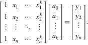
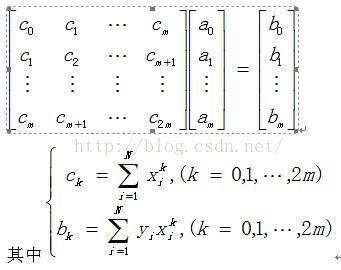

# implement and test some of the regression methods

## Regression methods list

1. least-squares (LS)
2. regularized LS (RLS)
3. L1-regularized LS (LASSO)
4. robust regression (RR)
5. Bayesian regression (BR)

## Implement Discussion

### Read The Data

this program is wrote by Python3, using package scipy and numpy as the utils of matrix calculating and data import. Following is the read sample prcoss

### Calculating Implements

1. Least-Squares Regression

According to the LSR algorithm, we should figure out the vector A = [a0...ak], which can be calculated as A = (X' \* X) - 1 \* X' \* Y
